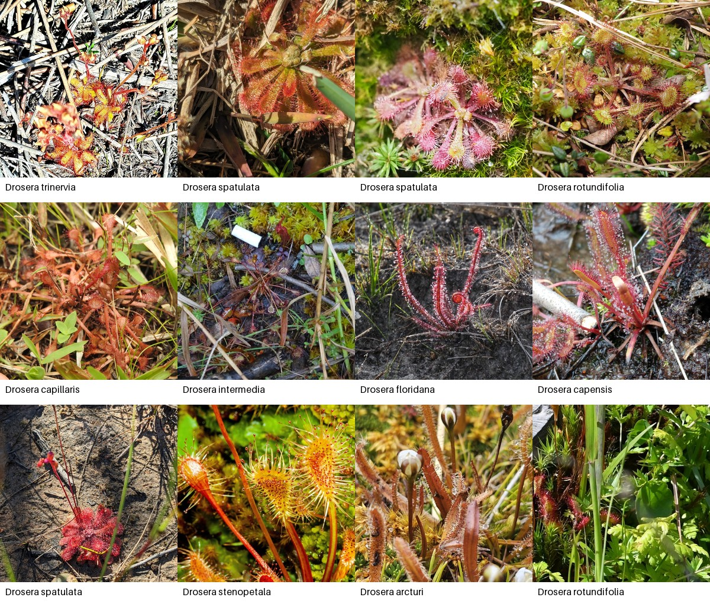

# Sundew Segmentation

This project builds a reproducible dataset and model for segmenting visible sundew tissue in RGB photographs. The initial model comparison will use U-Net with a ResNet-34 encoder and SegFormer-B0, followed by optional Detectron2 instance segmentation if overlapping rosettes require it.



## Current status

- Project and reference-repository research are documented in `docs/`.
- The acquisition pipeline downloads only Research Grade, non-captive iNaturalist photographs whose individual photo license is CC0 or CC BY.
- Exact coordinates are deliberately excluded.
- 500 licensed candidates have been acquired and visually screened.
- A 250-image core set is normalized and split by observer for mask annotation.
- A local Label Studio project and CPU MobileSAM backend provide interactive mask
  proposals for those 250 images.
- CLIPSeg-guided MobileSAM can prefill all 250 tasks with reviewable model proposals;
  these remain separate from accepted annotations and training masks.
- Downloaded images remain outside Git; source, attribution, curation, and split manifests are reproducible.

## Acquire candidate images

Use Python 3.10 or newer with Pillow installed:

```powershell
$env:PYTHONPATH = "src"
python scripts/acquire_inaturalist.py --count 500
python scripts/make_contact_sheets.py --output data/reports/curation_sheets --page-size 30 --columns 5 --thumb-size 256 --font-size 16
python scripts/build_curated_dataset.py
python scripts/export_label_studio_tasks.py
python scripts/audit_dataset.py
python scripts/validate_dataset.py --verify-hashes
```

The downloader records the creator, attribution, license, source page, source photo ID, dimensions, checksum, and acquisition time for every image. It caps repeated species and photographers and keeps one photo per observation.

The curation step retains every original, marks unsuitable frames, creates a diverse 250-image core set, and assigns all images from a photographer to the same train, validation, or test split. Its JPEG derivatives apply EXIF orientation and resize the longest side to at most 1600 pixels. The next data milestone is human correction of model-assisted masks; generated mask proposals must not be treated as ground truth.

## Start annotation

After running `scripts/install_annotation_stack.ps1` once with Python 3.10 or
newer, start Label Studio and the MobileSAM service, then initialize the project:

```powershell
powershell -ExecutionPolicy Bypass -File scripts/start_label_studio.ps1
powershell -ExecutionPolicy Bypass -File scripts/start_mobilesam_backend.ps1
.tools\label-studio-venv\Scripts\python.exe scripts/initialize_label_studio_project.py
.tools\label-studio-venv\Scripts\python.exe scripts/generate_sam_preannotations.py --upload --skip-reviewed
```

The batch command downloads the CLIPSeg semantic guide on its first run, then stores
its unreviewed masks under `data/annotations/sam-proposals/` and displays them as
predictions in Label Studio. See [the annotation workflow](docs/annotation-workflow.md)
for the review process.

## Usage constraint

This is a personal, noncommercial research portfolio. iNaturalist's terms prohibit using iNaturalist data for commercial AI or machine-learning training. Third-party photographs retain their individual licenses; the software license does not relicense them.

See [the project plan](docs/project-plan.md) and [the source and licensing audit](docs/free-image-sources.md).

## Baseline models

The planned comparison is a U-Net with a ResNet-34 encoder against SegFormer-B0. Configurations and framework-independent metrics live in `src/sundew_segmentation/baseline.py`; model dependencies are optional. Before masks are released, run the CPU smoke check:

```powershell
$env:PYTHONPATH = "src"
python scripts/baseline_smoke.py
```

The smoke output verifies deterministic image loading and records a simple sanity mask statistic. It is not a quality benchmark. `scripts/baseline_data_check.py` refuses to train when reviewed masks are missing. Once they exist, `scripts/train_baseline.py` trains either architecture with combined BCE and Dice loss, AdamW regularization, cosine learning-rate scheduling, and early stopping, then records IoU, Dice, precision, recall, and pixel accuracy on the observer-held-out validation split.

```powershell
$env:PYTHONPATH = "src"
python scripts/train_baseline.py --model unet-resnet34
python scripts/train_baseline.py --model segformer-b0
```

Training is deliberately gated on reviewed masks. Validate the future training boundary with `python scripts/baseline_data_check.py`; it fails if any image in the train or validation split lacks a same-size `data/curated/masks/<split>/<image-stem>.png` file. Use `--allow-missing` only for an inventory check.

Annotation instructions are in [the annotation workflow](docs/annotation-workflow.md),
the label definition is in [the annotation policy](data/annotation-policy.md), and
the release-ready documentation starts with [the dataset card](reports/dataset-card.md),
and the metadata release procedure is in [the release guide](docs/dataset-release.md).
