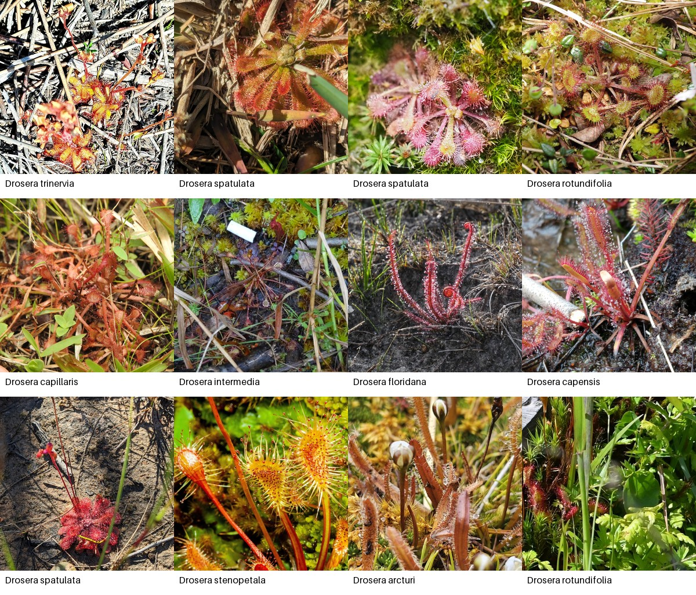

# Sundew Segmentation

A reproducible pipeline that segments visible sundew (*Drosera*) tissue in RGB photographs, crops each photo to the predicted plant, and classifies the crop to species. The dataset is built from licensed iNaturalist photographs; models are trained on the Hellbender SLURM cluster with paired seeds and decision rules fixed before each run.



## Current status

- 500 Research Grade, non-captive iNaturalist photographs (CC0 or CC BY) acquired and screened; a 250-image core split by observer. Exact coordinates are never stored.
- Masks drawn in Label Studio from CLIPSeg-guided MobileSAM proposals, then human-reviewed: 191 accepted pairs frozen as v0.3.0 (144 train / 19 validation / 28 test), plus 30 field masks and 17 field-evaluation images.
- Segmentation: SegFormer-B0 beats U-Net/ResNet-34, validation IoU 0.632 vs 0.610, 5 of 5 seeds. Adding the 30 field masks raised IoU on uncurated field photos from 0.552 to 0.613 (5 of 5 seeds) and roughly halved median area error, 32% to 16%.
- Crop check: 12 of 493 uncurated photos (2.43%, 95% CI 1.40-4.21%) gave a crop without the plant, under the 5% gate set in advance.
- Species corpus: 110 species, 17,678 images (CC0/BY/NC), observer-grouped split, with a 2,601-image held-out test split.
- Cropping helps a ResNet-18 classifier: balanced accuracy 0.546 on crops vs 0.525 on full frames at 110 species (+0.021, 5 of 5 seeds; +0.025 at 10 species). On the test-carved split the anchor is 0.516 vs 0.499.
- Frozen-backbone screen with a linear probe: BioCLIP-2 0.750, DINOv2-L 0.729; seven of nine frozen backbones beat the fine-tuned ResNet-18.
- Fine-tuned teachers (5 seeds, `split-110-test`, validation): DINOv2-L 0.824 on full frames and 0.820 on crops, BioCLIP-2 0.802 / 0.799, against a ResNet-18 anchor of 0.499 / 0.516 on the same split. DINOv2-L wins on every arm, 5 of 5 seeds, and after fine-tuning the crop no longer beats the full frame. The held-out test split is not yet scored (`reports/species-finetune.md`).
- Small-backbone screen for an on-device student (11 backbones, 8-35M parameters): frozen DINOv2-S reaches 0.637 [0.613, 0.664] on crops, above the 0.58 bar set in advance, so DINOv2-S is the student; TinyViT-21M (0.620) is not separated from it and ties or leads without the crop.
- Downloaded images stay outside Git; manifests, splits and attribution are reproducible.

## Build the dataset

Python 3.10 or newer with Pillow:

```powershell
$env:PYTHONPATH = "src"
python scripts/acquire_inaturalist.py --count 500
python scripts/make_contact_sheets.py --output data/reports/curation_sheets
python scripts/build_curated_dataset.py
python scripts/export_label_studio_tasks.py
python scripts/validate_dataset.py --verify-hashes
```

The downloader records creator, attribution, license, source page, photo ID, dimensions and checksum for every image, caps repeated species and photographers, and keeps one photo per observation. Curation keeps every original, marks unsuitable frames, and assigns all of a photographer's images to one split.

## Annotate

After running `scripts/install_annotation_stack.ps1` once, start Label Studio and the MobileSAM backend, initialize the project, and prefill proposals:

```powershell
powershell -ExecutionPolicy Bypass -File scripts/start_label_studio.ps1
powershell -ExecutionPolicy Bypass -File scripts/start_mobilesam_backend.ps1
.tools\label-studio-venv\Scripts\python.exe scripts/initialize_label_studio_project.py
.tools\label-studio-venv\Scripts\python.exe scripts/generate_sam_preannotations.py --upload --skip-reviewed
```

Proposals stay under `data/annotations/sam-proposals/` until a person accepts them; see [the annotation workflow](docs/annotation-workflow.md) and [the annotation policy](data/annotation-policy.md). Ambiguous and rejected annotations are never exported as masks.

## Train the segmentation models

Export and freeze the reviewed masks, then train locally or on Hellbender (environment in `environment.yml`, built by the setup job):

```powershell
$env:PYTHONPATH = "src"
python scripts/export_reviewed_masks.py
python scripts/freeze_reviewed_dataset.py
python scripts/train_baseline.py --model segformer-b0
```

```bash
sbatch scripts/hellbender_setup.slurm
sbatch scripts/hellbender_seed_sweep.slurm      # U-Net vs SegFormer, 5 seeds
sbatch scripts/hellbender_field_compare.slurm   # curated vs +30 field masks
```

`scripts/train_baseline.py` uses combined BCE and Tversky loss, AdamW, cosine scheduling and early stopping; Tversky weights false negatives to keep thin leaves. Results are in `reports/baseline-seed-sweep.md` and `reports/field-compare.md`; the cluster guide is [Hellbender training](docs/hellbender-training.md).

## Train the species classifier

Scrape the corpus, crop every image with the field-trained SegFormer, train the ResNet-18 baseline, then screen and fine-tune backbones:

```bash
sbatch scripts/hellbender_species_corpus.slurm
sbatch scripts/hellbender_species_110_crops.slurm
sbatch --array=0-4 scripts/hellbender_species_110.slurm   # full frames; 5-9 once crops exist
jid=$(sbatch --parsable scripts/hellbender_backbone_screen.slurm)
sbatch --dependency=afterok:$jid scripts/hellbender_backbone_screen_summary.slurm
sbatch --array=0-14 --export=ALL,MODEL=bioclip-2 scripts/hellbender_species_finetune.slurm
```

Results are in `reports/crop-review-result.md`, `reports/species-110-baseline.md`, `reports/species-backbone-screen.md` and `reports/species-finetune.md`; the plan and decision rules are in [the species classifier plan](docs/species-classifier-plan.md).

## Usage constraint

This is a personal, noncommercial research portfolio. iNaturalist's terms prohibit using its data for commercial AI training. Photographs keep their individual licenses (see [the licence policy](docs/licence-policy.md)); the software license does not relicense them. See also [the project plan](docs/project-plan.md), [the dataset card](reports/dataset-card.md) and [the release guide](docs/dataset-release.md).
